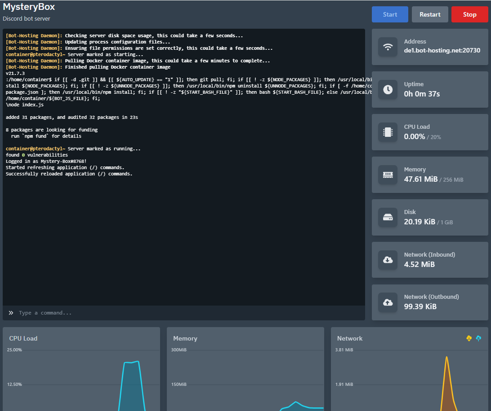

# Mystery Chest Discord bot to send videos but with more swag!!!!

### Bot hosted (Install link: https://discord.com/oauth2/authorize?client_id=1303530091808292875)

### Website hosted (View link: https://time-capsule-kappa.vercel.app/)

### Database

## Inspiration
Orginally I wanted to make a time capsule, that will store chats, and images in a chest and will be sent to you in a dm some time later so you can reminiscent about it but I pivot as it was complicated and I didn't know how to learn how to make a cdn so instead I just store a videos only. But I still achieve my goal for the project which was to learn three.js(animation like the chest, lights, etc), how to make a discord bot(slash commands, hosting, etc), and database (storing stuff with pocketdb).

## What it does
This project was just a silly little thing I made for fun. But it allows people to add some flair when sending youtube video recommendations. 

## How I built it
I used react, pocketbase, discord.js and deployed our project on to the cloud for ease of access! But I hope to move it onto my raspberry pi, or nest.

## Challenges I ran into
I ran into alot of trouble with animating the chest and getting the video on it. 

## Accomplishments that I'm proud of
I really like how the animation turn out, how I incorparted different technology together.

## What I learned
How to code with three.js, react rounter, more about discord bots, and pocket database.

## What's next for Mystery Chest Discord bot
I hope to learn more about cdn and how to intergrate it to allow the user to add images, gif, aniamtions etc. I also hope to learn blender and how to edit 3-models to allow the user to choose the styling for chest and maybe more background and styling.